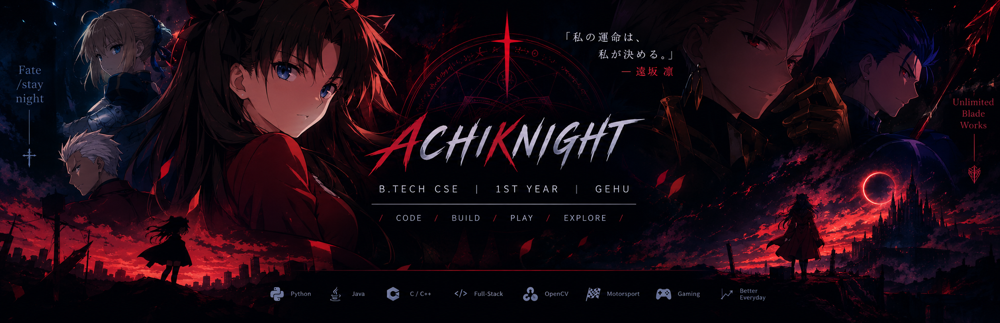

<div align="center">



<br>


</div>

---

<div align="center">

### `CODE • BUILD • PLAY • EXPLORE`


</div>

---

## ⚔️ `PROFILE`

```text
NAME        → Achiknight
ROLE        → B.Tech CSE Student
YEAR        → 1st Year
FOCUS       → Software Development
CURRENTLY   → Java • C/C++ • Git • Full-Stack • OpenCV

INTERESTS
├── Backend Development
├── Game Development
├── Computer Vision
├── Motorsport
└── Building questionable projects at questionable hours
```

<div align="center">


</div>

---

## 🔥 `CURRENT ARC`

```text
Python
   ↓
Java
   ↓
C / C++
   ↓
Git & GitHub
   ↓
Full-Stack
   ↓
Backend
   ↓
Game Features
```

> Learn it. Build it. Break it. Debug it. Understand it.

---

## 🏎️ `OUTSIDE THE TERMINAL`

**F1 • WEC • MotoGP • F2 • F3**

Motorsport isn't just about watching races — I'm interested in the engineering behind them:

`AERODYNAMICS` • `TELEMETRY` • `VEHICLE DYNAMICS` • `ECU` • `PERFORMANCE`

And when I'm not doing that...

**🎮 Gaming with friends.**

---

## 📊 `GITHUB`

<div align="center">


<br><br>


<br><br>


</div>

---

<div align="center">

### `UNLIMITED CODE WORKS`


</div>
